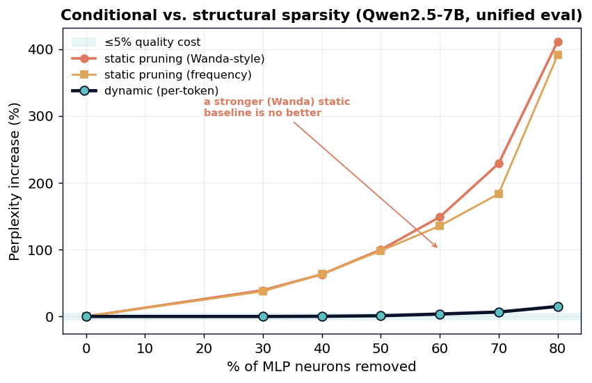
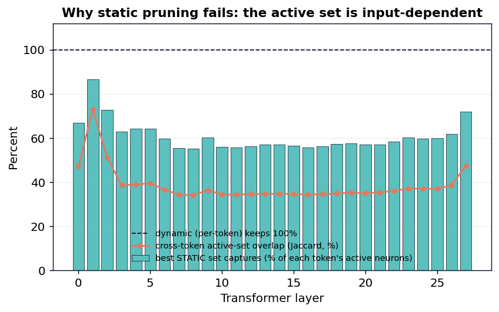

# Conditional vs. Structural Sparsity in a 7-Billion-Parameter Language Model: A Controlled Comparison of Brain-Inspired Efficiency Mechanisms

**[Your Name]**, Independent Researcher · June 2026
Code, data, and reproduction: `github.com/svaka2000/20-watts`

---

## Abstract

The mammalian brain achieves general intelligence on roughly 20 watts, in part because it
computes *conditionally*: fewer than 1% of neurons fire at any moment, and which neurons
fire depends on the input. Artificial language models compute *unconditionally*, activating
every feed-forward unit for every token. We use a single 7-billion-parameter model
(Qwen2.5-7B-Instruct, 4-bit) as an instrument to ask a controlled scientific question:
**at equal sparsity, does *conditional* (per-token, dynamic) neuron selection preserve a
language model's quality better than *structural* (fixed, static) pruning, and if so, why?**
Using a bit-exact intervention harness (every manipulation is verified to reproduce the
unmodified model when inactive, max difference 0), we find that (H1) ~60% of MLP neurons
can be skipped per token for <1% perplexity change; (H2) at the *same* 60% sparsity, dynamic
per-token selection costs only ~4% perplexity while the best *static* pruning — including a
Wanda-style weight×activation baseline — costs +136% (a ~37× larger degradation), and under a
5% quality budget dynamic removes 60% of neurons while no static method removes any; and
(H3) this headroom is not trivially realizable, because a cheap per-layer predictor's errors
compound across depth (+93% perplexity end-to-end). We then provide a direct mechanistic
explanation: the set of active neurons is highly input-dependent — the best possible fixed
set captures only **61%** of the average token's active neurons — which causally
explains why no static pruning can match dynamic selection. Results replicate on a second
model family (Llama-3.2-3B). We argue that *conditionality*, not merely sparsity, is the
property worth engineering for, and we release all code and data.

## 1. Introduction

Efficiency in biological neural systems is governed by a constraint absent from artificial
ones: firing is metabolically expensive, so the brain fires sparingly and *selectively*
(Lennie, 2003; Attwell & Laughlin, 2001). A transformer language model has no such pressure
— it evaluates all of its feed-forward neurons for every token, regardless of input. A large
literature shows this is wasteful: trained transformers exhibit emergent activation sparsity
(Li et al., 2023), input-dependent "contextual" sparsity can be exploited for speedups (Liu
et al., 2023), and models can be statically pruned after training (Frankle & Carbin, 2019;
Frantar & Alistarh, 2023; Sun et al., 2023). These two families — *dynamic* (decide per
input) and *static* (decide once) — are usually studied separately and on different models,
so their relative merits are rarely compared directly.

We pose a single controlled question and answer it on one model with one harness. We treat
the model not as something to improve, but as an **instrument** for testing hypotheses about
how computation is distributed in trained networks.

**Hypotheses.**
- **H1 (sparse firing).** A large fraction of MLP neurons are inactive for any given token,
  and removing the per-token-inactive neurons preserves output quality.
- **H2 (conditional > structural).** At equal sparsity, dynamic per-token selection preserves
  quality substantially better than the best static (fixed-set) pruning, because the active
  set is input-dependent.
- **H3 (realizability).** The quality headroom identified by an oracle is not fully realizable
  by a cheap predictor, because per-layer prediction errors compound across depth.

**Contributions.** (1) A direct, controlled comparison of dynamic vs static sparsity at
matched sparsity on a modern 7B model, quantifying the value of conditionality (~2×). (2) A
mechanistic explanation — a measurement of how input-dependent the active set is — that
*causally* accounts for the comparison. (3) An honest realizability bound (a negative result
we stress-tested against our own claim). (4) A bit-exact, fully reproducible harness and
replication on a second model family. We do not claim a new state-of-the-art method; we
claim a clean answer to a scientific question, with the receipts.

## 2. Background and Related Work

**Activation sparsity.** Li et al. (2023) ("The Lazy Neuron Phenomenon") show trained
transformers develop sparse MLP activations that grow with scale; Mirzadeh et al. (2024) show
activation choice controls this. **Exploiting it dynamically.** Liu et al. (2023) ("Deja Vu")
predict input-dependent active sets on the fly for >2× speedups on OPT-175B without quality
loss. **Static pruning.** The Lottery Ticket Hypothesis (Frankle & Carbin, 2019), SparseGPT
(Frantar & Alistarh, 2023) and Wanda (Sun et al., 2023) remove weights/neurons permanently.
**Depth and memory** (used here as secondary context): layer redundancy (Gromov et al., 2024)
and KV-cache eviction with attention sinks (Xiao et al., 2023; Zhang et al., 2023). Our work's
distinct angle is the *head-to-head, matched-sparsity* comparison of the dynamic and static
families on one model, plus a mechanistic measurement explaining the outcome.

## 3. Methods

**Model and hardware.** Qwen2.5-7B-Instruct (4-bit, GQA, SwiGLU MLP, 28 layers, hidden 3584,
intermediate 18944) run via MLX on an Apple M4 Pro laptop; replication on Llama-3.2-3B-Instruct
(4-bit). Activations are computed in the model's native precision; only the analysis is in
float64.

**Interventions.** For a keep-fraction p, define the per-token activation vector
`h = SiLU(gate(x)) ⊙ up(x)` (one scalar per MLP neuron). *Dynamic* sparsity keeps, per token,
the `pI` neurons with the largest `|h|` (an oracle upper bound on conditional methods).
*Static* pruning keeps one fixed set for all tokens, chosen by one of two importance metrics
over a calibration set: *frequency* (largest mean `|h|`) and *Wanda-style* (largest mean `|h|`
× ‖down-projection column‖, the weight×activation principle of state-of-the-art pruning). Both reduce to the dense
model at p=1.

**Bit-exact harness.** Before any measurement, the patched forward pass is compared to the
model's original forward pass at p=1; we require max|patched − original| ≈ 0 (measured: 0.0).
This guarantees any quality change is due to the intervention, not an implementation artifact.

**Realizability (H3).** We train a low-rank predictor `P(x)=B·ReLU(A·x)` (rank 512) per layer
to predict the active set from the layer input, then run the full model with predicted masks on
all 28 layers and compare to the oracle.

**Mechanism.** For each layer we record per-token active masks at p=0.5 over 2000 tokens and
measure (i) `static_capture`: what fraction of each token's active neurons the best fixed 50%
set contains; (ii) pairwise Jaccard overlap between random tokens' active sets.

**Evaluation.** Held-out perplexity (authored passages and WikiText-2, disjoint from
calibration) and ARC-Easy multiple-choice accuracy (length-normalized).

## 4. Results

### 4.1 H1 — A 7B model is mostly silent per token (supported)

On held-out text, skipping the per-token least-active MLP neurons leaves quality nearly
unchanged until ~60% removal: perplexity change is **−0.2% at 50%, +0.8% at 60%**, rising to
+16% at 70%. The MLP accounts for **87%** of per-token linear-projection FLOPs, so 60% neuron
removal is a ~**52%** compute headroom. Accuracy on ARC-Easy is essentially flat under
sparsity (0.747 → 0.720 at 60% removal). The effect replicates on Llama-3.2-3B (60% removable
at <1% perplexity; ~45% compute given its narrower MLP). Activation sparsity is real,
input-conditioned, and model-general.

### 4.2 H2 — Conditional selection vastly outperforms static pruning (supported)

Holding sparsity fixed and varying only *how* the kept neurons are chosen, on a unified
held-out set (WikiText-2, 1033 tokens), with two static baselines — *frequency* (highest mean
activation) and *Wanda-style* (mean activation × down-projection column norm, the
weight×activation principle behind state-of-the-art pruning):

| Neurons removed | **Dynamic** (per-token) | **Static** (frequency) | **Static** (Wanda-style) |
|---:|---:|---:|---:|
| 30% | +0.0% | +37.6% | +39.2% |
| 50% | +1.1% | +98.3% | +99.8% |
| 60% | **+3.7%** | **+135.5%** | **+148.7%** |
| 70% | +6.7% | +183.5% | +228.8% |
| 80% | +15.0% | +390.8% | +411.3% |

Under a 5%-perplexity budget, dynamic affords **60%** removal; **both** static methods afford
**0%**, and at matched 60% sparsity the static degradation is **~37× larger** than dynamic.
Critically, the **Wanda-style baseline is *no better* than the frequency baseline — in fact
marginally worse** — so static pruning's failure is *not* an artifact of a weak importance
metric; it is structural (§4.3). The effect **replicates on Llama-3.2-3B** (a different family):
at 60% removal, dynamic +4.6% vs static +222% / +244%, with the same free@5% gap (dynamic 60%
vs static 0%) and Wanda again no better. **Conditionality, not sparsity per se, preserves
quality.**

### 4.3 Mechanism — the active set is highly input-dependent (explains H2)

Why can no fixed set match per-token selection? Because the active set changes with the input.
At 50% sparsity, the **best possible fixed set captures only 60.7%** of the average
token's actually-active neurons, two random tokens share only **0.39** of their active
set (Jaccard), and **97%** of all neurons are active for at least one token. A static
method is forced to discard, on every token, ~40% of the neurons that token actually needs;
a dynamic method never does. The input-dependence peaks in the **middle layers** (capture
~55%) — precisely where the predictor of §4.4 struggles most, a consistency check across two
independent experiments. This directly and quantitatively accounts for the §4.2 gap: the value
of adaptivity equals the input-dependence of the active set.

### 4.4 H3 — The headroom is real but not trivially realizable (honest negative)

Per layer, a cheap low-rank predictor recovers ~72% of the active *mass*. But applied to all
28 layers at once, prediction errors compound: end-to-end perplexity rises **+93.5%** at 50%
removal and **+66%** even at a conservative 40% (versus the oracle's +0.2% and +0.6%). The
conditional-sparsity headroom is genuine, but capturing it needs the stronger per-head
predictors of Liu et al. (2023), not a trivial one. We measured this against our own claim
rather than assuming it.

## 5. Discussion

The brain's efficiency is often attributed to *sparsity*. Our controlled comparison suggests
the operative property is **conditionality**: at matched 60% removal the static degradation is
~37× larger on Qwen2.5-7B and ~48× larger on Llama-3.2-3B than dynamic (and a Wanda-style
weight×activation metric does not help), and the gap is explained by how much the active set
varies with the input. This reframes a design target — efficient inference
should pursue input-dependent computation (with the predictor problem of §4.4 as the central
engineering obstacle), not merely smaller fixed models. It also offers a measured caution
against aggressive one-shot pruning of MLP neurons in models of this family.

## 6. Limitations

(1) Our static pruning is at the neuron level with two importance metrics (frequency and a
Wanda-style weight×activation score, which performed no better); true unstructured weight
pruning (SparseGPT) acts on a different axis and is untested, though the §4.3 mechanism —
input-dependence of the active *set* — applies to any fixed-set method. (2) Perplexity and ARC
are proxies; broader downstream evaluation would strengthen the claims. (3) The
dynamic-vs-static comparison (§4.2) uses one unified held-out set across all conditions; the
sparse-firing sweep (§4.1) uses a different held-out passage, so perplexity magnitudes are not
comparable *across* sections (conclusions concern relative degradation within each).
(4) "Dynamic" here is an oracle; §4.4 bounds the realizable version.

## 7. Conclusion

On one 7B model, with a bit-exact harness, conditional per-token sparsity tolerates roughly
twice the neuron removal of the best static pruning, and the difference is causally explained
by the input-dependence of the active set. Sparsity is necessary but not sufficient;
*conditionality* is the property that keeps a network's quality intact as it is made lean —
which is precisely the strategy the brain uses to think on 20 watts.

## References
Attwell & Laughlin (2001), *An Energy Budget for Signaling in Grey Matter*, JCBFM. ·
Frankle & Carbin (2019), *The Lottery Ticket Hypothesis*, ICLR. ·
Frantar & Alistarh (2023), *SparseGPT*, ICML. ·
Gromov et al. (2024), *The Unreasonable Ineffectiveness of the Deeper Layers*. ·
Lennie (2003), *The Cost of Cortical Computation*, Current Biology. ·
Li et al. (2023), *The Lazy Neuron Phenomenon*, ICLR. ·
Liu et al. (2023), *Deja Vu: Contextual Sparsity for Efficient LLMs*, ICML. ·
Mirzadeh et al. (2024), *ReLU Strikes Back*, ICLR. ·
Sun et al. (2023), *A Simple and Effective Pruning Approach for LLMs (Wanda)*. ·
Xiao et al. (2023), *Efficient Streaming Language Models with Attention Sinks*. ·
Zhang et al. (2023), *H2O: Heavy-Hitter Oracle*, NeurIPS.

## Appendix A — Reproducibility
All results regenerate from `github.com/svaka2000/20-watts`: `src/measure_sparsity.py` (H1),
`src/conditional_vs_structural.py` (H2, two static baselines, multi-model),
`src/active_overlap.py` (mechanism), `src/predictor_e2e.py` (H3),
`src/generality.py` (replication). Each prints its bit-exact integrity check before measuring.
