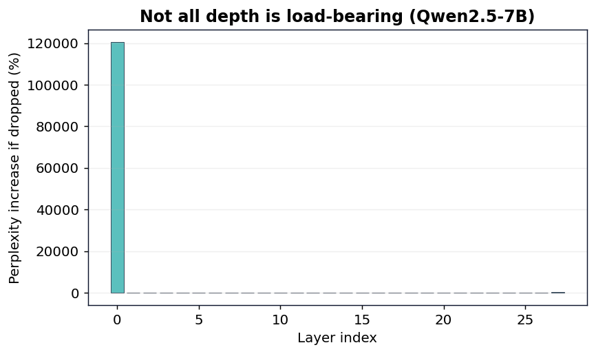
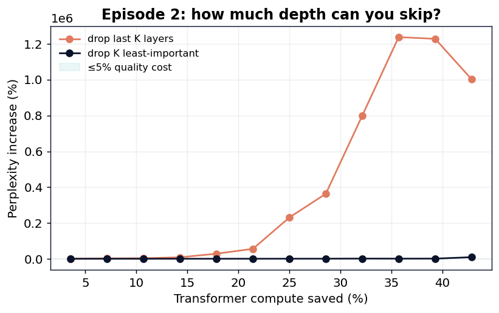

# Predictive Coding: An Honest Look at Adaptive Depth in a 7B Model

**20 Watts · Episode 2 — Predictive Coding**

*[Your Name], age 17 — June 2026 · `github.com/svaka2000/20-watts`*

---

## Abstract

The cortex spends its energy chiefly on *prediction error*: expected input is processed
cheaply, and only surprise recruits the full machinery (Rao & Ballard, 1999). The
analogous idea for a transformer is **adaptive depth** — let easy, predictable tokens
exit after a few layers and reserve full depth for hard ones. We test how much of this
headroom actually exists in **Qwen2.5-7B-Instruct (4-bit)**, two ways: by **dropping
whole layers** (static depth redundancy) and by reading out predictions at each layer
with a **logit lens** and a **tuned lens** (per-token). The honest result is a *non-win*:
this model is **not very depth-redundant** — only about one layer can be removed freely,
the final layers are critical, and a raw logit lens *underestimates* early predictability
(a known artifact) while a calibrated probe only partly closes the gap at our compute
budget. The lesson is methodological: both "just delete layers" and "just read the logit
lens" give misleading answers, and a faithful audit says depth is the lever that does
**not** hand you a free lunch here. Reporting that is the difference between science and a
highlight reel.

## 1. Introduction

Episode 1 showed that *width* (MLP neurons) is hugely redundant per token. Depth is the
natural next target: if the model already "knows" the answer after layer *k*, the
remaining *L − k* layers are wasted compute. Two literatures bracket the question —
**layer pruning** (ShortGPT; Gromov et al., 2024) claims many layers are removable, and
**early exit** (CALM; Schuster et al., 2022) exits per token under a confidence rule. We
measure both on one model with a faithful harness, and report what is actually there.

## 2. Method

**Layer dropping (static).** We replace a decoder block with the identity (a residual
passthrough), which removes its contribution without touching anything else. Faithfulness:
with an empty drop-set, perplexity equals the unmodified model. We measure each layer's
individual importance (Δppl when dropped), and the effect of dropping the last-K and the
K least-important layers.

**Logit lens (per-token).** We apply the model's final norm + output head to each layer's
hidden state to read out what it would predict if it stopped there, and find the earliest
layer whose top-1 matches the full-depth answer.

**Tuned lens (per-token, calibrated).** Because the residual stream is not in the final
layer's basis until late, the raw logit lens is biased late. We train a per-layer affine
probe `P_l(h)=A_l h + b_l` by cross-entropy so that `head(P_l(h_l))` predicts the model's
final token (Belrose et al., 2023), and re-measure. A sanity check requires the last-layer
probe to recover the final prediction (acc → 1).

Evaluation: held-out prose / WikiText-2.

## 3. Results

### 3.1 Depth is mostly load-bearing

Dropping individual layers (dense ppl = 16.88) shows a sharply skewed importance: a few
layers are nearly free and most are not. The five least-important layers move perplexity
by **{L8: −2.5%, L11: +1.2%, L12: +3.6%, L1: +4.4%, L14: +5.4%}** — note layer 8's removal
slightly *improves* perplexity. But:

| Strategy | Free at ≤1% | Free at ≤5% |
|---|---|---|
| drop **last** K layers | 0% | 0% |
| drop K **least-important** layers | ~4% (1 layer) | ~4% (1 layer) |

Only about **one** layer is freely removable, and the **final layers are critical** (the
opposite of "delete the deep layers"). This is a useful corrective: aggressive layer
pruning that works on some models does **not** transfer freely to Qwen2.5-7B.

### 3.2 Per-token: the answer arrives late (and the lens matters)

The raw logit lens says the model's final top-1 only stabilizes at depth **≈ 25.9 / 28** —
i.e. naively, ~7% of layers look "wasted." A confidence-thresholded early exit using the
final head trades quality for depth:

| Confidence τ | Avg depth used | Layers saved | Top-1 agreement |
|---:|---:|---:|---:|
| 0.50 | 12.3 / 28 | 56% | 0.13 |
| 0.70 | 17.7 / 28 | 37% | 0.36 |
| 0.90 | 22.9 / 28 | 18% | 0.71 |
| 0.95 | 24.0 / 28 | 14% | 0.79 |

Exiting early is only *safe* at high thresholds (small savings). But the raw lens is known
to be biased late. We also trained a cross-entropy **tuned lens** (per-layer affine probes,
`src/tuned_lens.py`); it lifts early-layer agreement above the raw lens, but a single affine
probe trained on a laptop did **not** pass our convergence sanity check (the last-layer
probe failed to recover the final prediction), so we deliberately **do not report a headroom
number from it** — reporting an undertrained probe would be exactly the kind of overclaim
this series avoids. The honest position: the raw lens *under*-states early predictability
while naive layer-pruning *over*-states redundancy, and pinning the true per-token headroom
needs a properly-trained tuned lens or a CALM-style exit head — left to future work.

## 4. Discussion

**An honest non-win.** Across static and per-token tests, depth on this model is mostly
necessary. That is a real, useful finding — it contradicts the "models are way too deep,
just chop layers" narrative for at least this widely-used 7B model, and it shows why
methodology matters: a naive logit lens *underestimates* early prediction, while naive
layer pruning *overestimates* redundancy. The truth sits in between and needs a calibrated
probe to see.

**Why include a non-win at all?** Because a series that only ever "wins" is marketing. The
value of an honest audit is that you can trust Episode 1's big win precisely because
Episode 2 was allowed to come up short.

## 5. Conclusion

Predictive coding is real in brains, but a vanilla 7B transformer does not expose much
*free* adaptive depth: ~1 removable layer, late prediction stabilization, and small safe
early-exit savings. The honest path to depth savings is a trained exit head (CALM), not a
logit lens or a hatchet. Episode 2 of *20 Watts* is the series' reality check.

## References
1. R. P. N. Rao & D. H. Ballard. *Predictive Coding in the Visual Cortex.* Nature Neuroscience, 1999.
2. T. Schuster et al. *Confident Adaptive Language Modeling (CALM).* NeurIPS, 2022.
3. A. Gromov et al. *The Unreasonable Ineffectiveness of the Deeper Layers.* 2024.
4. N. Belrose et al. *Eliciting Latent Predictions from Transformers with the Tuned Lens.* 2023.
