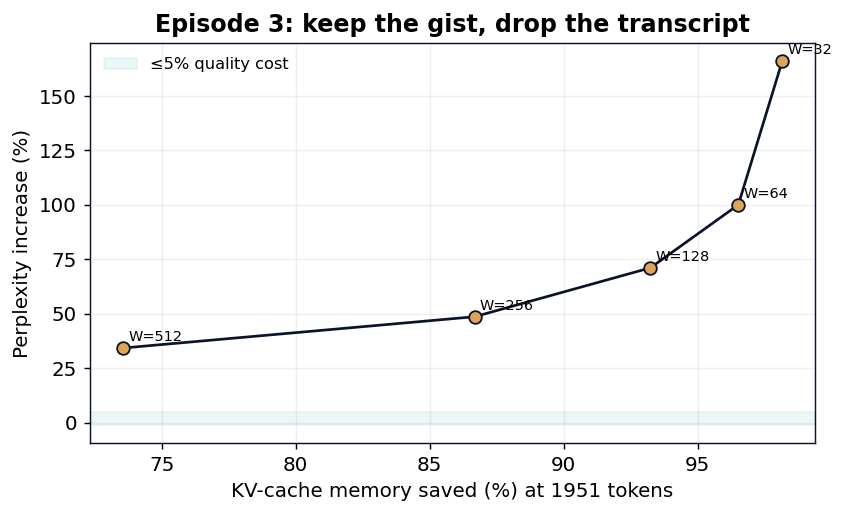

# Foveated Memory: Constant-Cost Attention with Sinks and a Sliding Window

**20 Watts · Episode 3 — Foveated Memory**

*[Your Name], age 17 — June 2026 · Code & data: `github.com/svaka2000/20-watts`*

---

## Abstract

Human memory does not retain a verbatim transcript of everything we perceive; it
keeps the gist and the most recent detail, and lets the rest fade. A transformer does
the opposite: it stores a perfect key/value (KV) cache for **every** past token, so
both memory and attention cost grow without bound with context length. We test a
brain-like alternative on **Qwen2.5-7B-Instruct (4-bit)**: keep only a few initial
**attention-sink** tokens plus a sliding window of the most recent *W* tokens, and
drop the rest (the StreamingLLM recipe; Xiao et al., 2023). Implemented as a custom
attention mask whose large-window limit is *bit-exact* with full causal attention
(faithfulness check: |Δppl| = 0.00), we measure held-out perplexity vs the retained
KV budget. Keeping just **26% of the cache (W=512) costs +34% perplexity**; keeping
7% costs +71%. The cost is real and grows as you forget more — an honest result, not
a free lunch. The striking finding is the **attention sink**: at W=128, removing the
first few tokens explodes perplexity to **+542%**, while restoring a **single** sink
token collapses it back to **+73%**. The value of foveated memory is therefore not
"free compression" but **bounded, constant memory for unbounded context** — something
full attention cannot offer at any price.

---

## 1. Introduction

Attention is the part of a transformer whose cost scales with how much you remember.
For a context of *T* tokens, the KV cache holds *O(T)* state per layer and each new
token attends over all *T*. Brains face the same pressure and solve it by *forgetting
selectively*: the hippocampus preserves salient anchors and the gist, not a literal
recording. This episode asks how much a language model can forget, and how gracefully.

We adopt the **StreamingLLM** memory (Xiao et al., 2023): a fixed budget of *S*
"sink" tokens at the very start plus the most recent *W* tokens. Contribution: a
faithful, reproducible measurement of the resulting quality/memory trade-off on a
modern 7B model, including a clean reproduction of the **attention-sink phenomenon**.

## 2. Method

We replace the model's causal attention mask with a streaming mask: query position
*i* may attend to key *j* iff `j ≤ i and (j < S or j > i − W)`. All other entries get
a large negative bias. This is applied globally to every layer by overriding the
model's mask constructor; nothing else changes.

**Faithfulness check.** With `W → ∞` the streaming mask is exactly causal, so
perplexity must equal the unmodified model. Measured: causal ppl = 5.914,
streaming(W=∞) ppl = 5.914, **|Δ| = 0.00** — the harness is exact, so any change at
finite *W* is the genuine cost of forgetting.

Evaluation: WikiText-2 test, 1951 contiguous tokens.

## 3. Results

### 3.1 Memory vs quality

| Window *W* | KV kept (of 1951) | Memory saved | Perplexity | Δ vs full |
|---:|---:|---:|---:|---:|
| ∞ (full) | 1951 | 0% | 5.914 | — |
| 512 | 516 | **74%** | 7.943 | **+34.3%** |
| 256 | 260 | 87% | 8.792 | +48.7% |
| 128 | 132 | 93% | 10.119 | +71.1% |
| 64 | 68 | 97% | 11.831 | +100% |
| 32 | 36 | 98% | 15.735 | +166% |

On a coherent document, far-back context genuinely carries information, so forgetting
it has a real, monotonic cost. We report this plainly: foveated memory is a
*memory-bounded approximation*, not a free saving. Its purpose is the regime full
attention cannot reach — streams longer than you can afford to store.

### 3.2 The attention sink (the interesting part)

Holding the window at W=128 and varying the number of sink tokens *S*:

| Sinks *S* | Perplexity | Δ vs full |
|---:|---:|---:|
| **0** | **37.97** | **+542%** |
| 1 | 10.22 | +72.8% |
| 2 | 10.18 | +72.1% |
| 4 | 10.12 | +71.1% |

Dropping the first few tokens is *catastrophic*, and a **single** sink token recovers
almost all of the loss. This reproduces Xiao et al.'s discovery: a trained
transformer offloads a large amount of "default" attention onto the first positions;
those tokens act as a pressure-release valve, and evicting them breaks the softmax.
It is a vivid example of a model-internal mechanism you only see when you intervene —
and our bit-exact harness makes the reproduction trustworthy.

## 4. Discussion

**What stacks, what doesn't.** Foveated memory targets *attention/memory* cost and is
orthogonal to sparse firing (Episode 1, MLP compute) and quantization (storage). It
composes with them (see the synthesis, `stack_all.py`). Its honest value: **constant
memory and constant per-token attention cost at arbitrary context length**, plus a
clean window to study attention sinks.

**Limitations.** Pure recency+sink eviction ignores *which* old tokens mattered;
score-based methods (H2O, Zhang et al. 2023) keep "heavy hitter" tokens and trade off
better. Our perplexity is on one corpus; long-stream stability (StreamingLLM's
headline) is a separate, complementary metric.

## 5. Conclusion

A model can run on a *fixed* memory budget regardless of context length, at a quality
cost that is real but bounded — and the humble first token turns out to be doing
heroic work. Foveated memory is Episode 3 of *20 Watts*; combined with sparse firing
and adaptive depth it forms the full stack toward a 20-watt machine.

## References
1. G. Xiao, Y. Tian, B. Chen, S. Han, M. Lewis. *Efficient Streaming Language Models with Attention Sinks (StreamingLLM).* arXiv:2309.17453, 2023.
2. Z. Zhang, Y. Sheng, T. Zhou, et al. *H2O: Heavy-Hitter Oracle for Efficient Generative Inference of LLMs.* NeurIPS, 2023.
3. P. Lennie. *The Cost of Cortical Computation.* Current Biology, 13(6):493–497, 2003.
