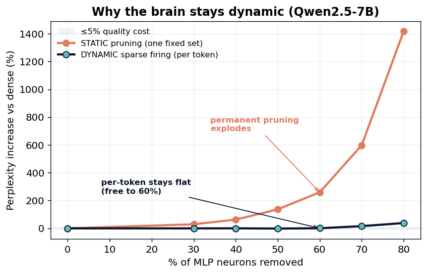

# Synaptic Pruning vs Sparse Firing: Why a Brain Stays Dynamic

**20 Watts · Episode 4 — Synaptic Pruning**

*[Your Name], age 17 — June 2026 · `github.com/svaka2000/20-watts`*

---

## Abstract

The brain economizes in two different ways. Once, during development, it permanently
**prunes** roughly half of its synapses (Huttenlocher, 1979) — a structural, one-time
decision. And continuously, it keeps almost every neuron **silent**, firing fewer than
1% at a time — a dynamic, input-by-input decision (Episode 1). We measure the *static*
kind on **Qwen2.5-7B-Instruct (4-bit)**: permanently remove the globally least-active
MLP neurons (ranked by mean activation over a calibration set) and read held-out
perplexity, then put it head-to-head with Episode 1's *dynamic* per-token sparsity at
the same neuron counts. The contrast is stark. **Dynamic sparsity is free up to 60%
skipping (+0.8% perplexity); the same fraction of *static* pruning costs +259%.** A
fixed pruning that removes just 30% of neurons already costs +29%, while skipping a
per-token-chosen 30% is free. Adaptivity is worth roughly **2× the sparsity**. The
lesson — and the reason the brain bothers to keep its pruned-down circuits dynamic — is
that *which* neurons a network needs is highly input-dependent: no single fixed subset
can serve every token.

## 1. Introduction

Episode 1 showed a 7B model only needs ~40% of its feed-forward neurons on any given
token, *if it is allowed to choose them per token*. A natural question is whether you
even need that machinery: could you just delete the neurons that are rarely useful, once,
and ship a permanently smaller model? That is **synaptic pruning** — the structural
counterpart to sparse firing, and a real strategy in both neuroscience and ML (the
Lottery Ticket Hypothesis, Frankle & Carbin 2019; SparseGPT, Frantar & Alistarh 2023;
Wanda, Sun et al. 2023). Static pruning has a huge practical advantage: it is **free to
realize** — a smaller weight matrix, no predictor, no special kernel. So the comparison
matters: how much quality do you pay for that convenience?

## 2. Method

**Global importance.** On a calibration corpus (WikiText-2, ~4k tokens) we record each
MLP neuron's mean activation magnitude, `importance_l[j] = mean_t |h_l[j]|` where
`h = SiLU(gate(x)) ⊙ up(x)`. This is an *activation-aware* importance (in the spirit of
Wanda), not naive weight magnitude.

**Static pruning.** For a keep fraction `p`, we build one fixed per-layer mask keeping
the top-`p` neurons by global importance, and apply it to **every** token. **Dynamic
sparsity** keeps, per token, the top-`p` neurons by that token's own `|h|` (Episode 1).
Both use the same bit-exact harness (integrity diff = 0 at `p=1`). We report held-out
perplexity on an authored passage not in the calibration set.

## 3. Results

| Neurons skipped | **Dynamic** (per-token) Δppl | **Static** (global prune) Δppl |
|---:|---:|---:|
| 0% | — (ppl 24.09) | — |
| 30% | **−0.2%** | **+29.4%** |
| 40% | +0.2% | +63.0% |
| 50% | −1.6% | +136.6% |
| 60% | **+0.8%** | **+259.4%** |
| 70% | +16.0% | +598.2% |
| 80% | +38.3% | +1419% |

At a 5%-perplexity budget, **dynamic affords 60% sparsity; static affords 0%**. Removing
even the *globally least-active* 30% of neurons permanently is far more damaging than
skipping a per-token-chosen 60%. The neurons that look idle on average are, for some
specific tokens, essential.

## 4. Discussion

**The value of adaptivity, quantified.** The ~2× sparsity gap is the price of committing
to one fixed circuit. It is also a clean explanation for the biology: a brain prunes to
remove what it *never* needs, then keeps the survivors dynamic because what it needs
*right now* keeps changing. Pruning and firing are not redundant; they are sequential.

**An honest caveat.** Our static baseline uses activation-aware global importance — a
reasonable metric, but not the state of the art. SparseGPT and Wanda use second-order or
weight×activation criteria and would shrink the gap, especially at low sparsity. They
cannot, however, escape the fundamental limit demonstrated here: a single fixed subset
cannot be optimal for inputs that need different subsets. The *direction* of the result
is robust even if the exact magnitudes would soften under a stronger pruner.

**What stacks.** Static pruning composes with quantization (a smaller *and* coarser
model) and is the most deployment-friendly lever (no runtime machinery). Dynamic sparsity
buys more, but only with the predictor of Episode 1. The efficient model of the future is
plausibly **pruned once, quantized, and then run sparsely** — all three.

## 5. Conclusion

Given the same 7B model, dynamic per-token sparsity tolerates roughly twice the neuron
removal of static pruning before quality breaks. The brain's two economies are not
interchangeable: prune what you never need, but stay dynamic about what you need now.
Episode 4 closes the loop opened in Episode 1 — and measures, in perplexity, why the
brain is dynamic at all.

## References
1. P. R. Huttenlocher. *Synaptic density in human frontal cortex — developmental changes and effects of aging.* Brain Research, 1979.
2. J. Frankle & M. Carbin. *The Lottery Ticket Hypothesis.* ICLR, 2019.
3. E. Frantar & D. Alistarh. *SparseGPT: Massive Language Models Can Be Accurately Pruned in One-Shot.* ICML, 2023.
4. M. Sun, Z. Liu, A. Bhojanapalli, et al. *A Simple and Effective Pruning Approach for LLMs (Wanda).* 2023.
5. Z. Li et al. *The Lazy Neuron Phenomenon.* ICLR, 2023.
6. Z. Liu et al. *Deja Vu: Contextual Sparsity for Efficient LLMs.* ICML, 2023.
